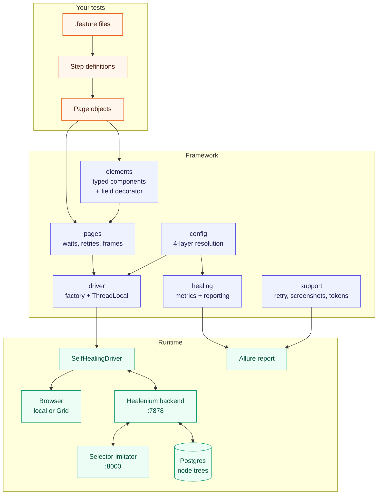

# healenium-selenium

**A production-grade, vendor-neutral Selenium test framework that repairs its own locators.**

[](https://github.com/abdul-alamer/healenium-selenium/actions/workflows/ci.yml)
[](https://openjdk.org/projects/jdk/17/)
[](https://gradle.org/)
[](https://www.selenium.dev/)
[](https://healenium.io/)
[](https://cucumber.io/)
[](https://allurereport.org/)
[](LICENSE)

---

## The problem

Locator churn is the largest maintenance cost in UI automation and the largest single source of
flakiness. A front-end team renames a container, swaps a CSS module, or upgrades a component
library. Nothing about the application's behaviour changed. Nothing about your assertions was wrong.
The suite is red anyway, and somebody spends the morning re-pointing selectors.

Teams pay for this twice: once in that morning, and again in the credibility the suite loses every
time it cries wolf. After enough false alarms, a red build stops meaning anything.

This framework attacks the problem from both ends:

- **Fewer locators to break.** Typed components mean a table is a `DataTable`, not forty lines of
  cell-walking repeated in six page objects. Less locator surface, less churn.
- **Locators that repair themselves.** [Healenium](https://healenium.io) recognises an element from
  the node tree it stored the last time the locator worked, so a renamed container costs a log line
  instead of a build - and the healed locator is reported as debt, not silently swallowed.

It is extracted from a large commercial Selenium/Cucumber suite, generalised until nothing
application-specific remained, and improved where the original had known weaknesses.

---

## Architecture



---

## How self-healing works

Three phases: **train → break → heal**.

```
train   locator matches  ──►  Healenium stores the element's node tree
                              (tag, attributes, text, sibling position, ancestor chain)

break   front-end change ──►  the same locator now matches nothing

heal    lookup fails     ──►  stored tree sent to the selector-imitator
                         ──►  every candidate node in the current DOM is scored
                         ──►  best score > score-cap ?  yes → element returned, test passes
                                                        no  → ElementNotHealedException
```

The rule that catches everybody first:

> **Healing can only repair a locator that has worked at least once.** There is nothing to compare
> against otherwise. A locator that was wrong the day it was written will never heal - it will fail,
> which is correct.

Two knobs: `score-cap` (how similar a candidate must be, default `0.5`) and `recovery-tries` (how
many stored trees to try, default `1`). Lower `score-cap` and healing succeeds more often but is
more likely to grab the wrong element. Start at the default and move it up, not down.

[docs/SELF_HEALING.md](docs/SELF_HEALING.md) has the full mechanism, a sample healing log, and the
section that matters most: **when self-healing is the wrong answer**.

---

## Quickstart

Requires JDK 17, Docker, and Chrome (or Firefox / Edge) installed. No driver binaries to download -
Selenium Manager handles that.

```bash
git clone https://github.com/abdul-alamer/healenium-selenium.git
cd healenium-selenium

# 1. Start the Healenium backend (backend :7878, imitator :8000, Postgres :5432)
docker compose -f docker/docker-compose.yml up -d

# 2. Run the smoke suite
./gradlew test -Ptags="@smoke"

# 3. Watch a broken locator repair itself
./gradlew test -Ptags="@self-healing"

# 4. Look at the reports
./gradlew allureReport            # build/reports/allure-report/index.html
open http://localhost:7878/healenium/report
```

No Docker? Run without healing:

```bash
./gradlew test -Ptags="@smoke" -PhealEnabled=false
```

### The money shot

`features/self_healing.feature` proves the mechanism in one scenario:

```gherkin
@self-healing
Scenario: The suite survives a front-end refactor that breaks a locator
  Given I open the "Dynamic Controls" example
  And the swap control has been located once, so its node tree is stored
  When the page is refactored so the learned locator no longer matches
  Then the swap control is found again and still reads the same label
  And the healing report records at least one recovered locator
```

The page object holds `@FindBy(css = "#checkbox-example button")`. Midway through the scenario the
container is renamed to `checkbox-example-v2` - the button itself untouched - and that locator
matches nothing. Healenium recognises the button anyway, because only one attribute of one ancestor
changed and the candidate scores far above `score-cap`.

Expected output:

```
14:22:07.881 INFO  c.e.h.h.BaseHealingService - Trying to heal locator: By.cssSelector: #checkbox-example button
14:22:08.104 INFO  c.e.h.h.BaseHealingService - Score: 0.94 for candidate: //form[@id='checkbox-example-v2']/button
14:22:08.311 WARN  c.e.h.SelfHealingDriver   - Healing completed. New locator: //form[@id='checkbox-example-v2']/button
14:22:08.402 INFO  i.g.a.s.h.HealingReportCollector - Self-healing: 3 log event(s) captured.
```

| Where to look | What you get |
|---------------|--------------|
| `http://localhost:7878/healenium/report` | The backend's report, with before/after screenshots of the healed element |
| `build/reports/allure-report/index.html` | Per-scenario healing summary, attached next to the scenario that healed |
| `build/healenium/summary.txt` | The whole run's healing activity, for CI to upload |

Run it with `-PhealEnabled=false` to see the same code fail with `ElementNotHealedException`. That
is the honest baseline - what the suite does without any of this.

---

## Writing your first page object

```java
public class OrdersPage extends BasePage {

  public static final String PATH = "/orders";

  @FindBy(css = "h1")                        private BaseComponent heading;
  @FindBy(id = "orders-table")               private DataTable orders;
  @FindBy(css = "[data-test='status']")      private SearchableDropdown statusFilter;
  @FindBy(css = ".bulk-actions input")       private Checkbox selectAll;

  public OrdersPage(WebDriver driver) {
    super(driver);
  }

  public void open() {
    openPath(PATH);                 // resolved against the configured base-url
  }

  @Override
  public void waitPageLoading() {   // what "ready" means for this page, stated once
    waitUntilPageLoaded();
    orders.waitUntilPopulated();
  }

  public void filterBy(String status) {
    statusFilter.selectByText(status);
    waitUntil(() -> orders.getColumnValues("Status").stream().allMatch(status::equals),
        "every visible order to have status " + status);
  }

  public List<String> visibleOrderIds() {
    return orders.getColumnValues("Order ID");   // addressed by header, not by td:nth-child(4)
  }
}
```

`orders` is a `DataTable`, not a `WebElement`. That is the framework's central trick: a custom
`PageFactory` field decorator injects **typed component objects**, including `List<SomeComponent>`,
so widget behaviour lives in the component and page objects stay about the page.

A class becomes injectable purely by declaring a constructor taking `(WebDriver, WebElement)` or
`(WebDriver, SearchContext, WebElement)`. No registry, no annotation, no configuration.

Full guide: [docs/WRITING_PAGE_OBJECTS.md](docs/WRITING_PAGE_OBJECTS.md).

### Component catalogue

| Component | For | Highlights |
|-----------|-----|------------|
| `BaseComponent` | Anything | click with scripted fallback, `getInnerText`, `isDisplayedFast`, locator-retaining stale recovery |
| `DataTable` | Tables read by column header | `getColumnValues("Due")`, `getRow`, `containsValueInColumn`, `findRowIndex` |
| `SelectDropdown` | Native `<select>` | `selectFirstEnabled()` skips the disabled placeholder |
| `SearchableDropdown` | Scripted combo boxes | waits for the menu; handles portalled menus via one override |
| `AutoComplete` | Type-ahead fields | `typeAndSelect` waits for asynchronous suggestions |
| `Checkbox` | Checkbox or group | states outcomes (`check`/`uncheck`), never toggles by accident |
| `ListBox` | Dual list box | `choose`, `remove`, `clearChosen`; structure is overridable |
| `IFrame` | Iframes | `inFrame(...)` switches back in a `finally`, so a failure cannot strand the driver |

Adding your own is one file: extend `BaseComponent`, declare the four constructors, and `@FindBy`
picks it up.

---

## Configuration

Four layers, highest precedence first: **system property** (`-D`, which is what Gradle `-P` becomes)
→ **environment variable** → **`<env>-config.properties` overlay** → **`default-config.properties`**.

| Key | Default | Meaning |
|-----|---------|---------|
| `base-url` | `https://the-internet.herokuapp.com` | Application under test |
| `browser` | `chrome` | `chrome`, `firefox`, `edge` |
| `headless` | `true` | New headless mode for Chromium browsers |
| `remote-url` | *(empty)* | Grid endpoint; empty means a local browser |
| `selenium-window-width` / `-height` | `1366` / `768` | Window size |
| `selenium-implicit-wait-timeout-in-seconds` | `5` | Keep it short - see note below |
| `selenium-web-driver-wait-timeout-in-seconds` | `30` | Explicit wait ceiling |
| `selenium-page-load-timeout-in-seconds` | `30` | Navigation ceiling |
| `selenium-script-timeout-in-seconds` | `30` | Async script ceiling |
| `retry-attempts` | `3` | Attempts for `Retry` / `BasePage.retry` |
| `retry-backoff-in-millis` | `200` | Multiplied by the attempt number |
| `parallel-thread-count` | `1` | Informational; parallelism is set by `-Pthreads` |
| `screenshot-on-failure` | `true` | Attach a screenshot when a scenario fails |
| `heal-enabled` | `true` | Whether locators are repaired at all |
| `hlm.server.url` | `http://localhost:7878` | Healenium backend |
| `hlm.imitator.url` | `http://localhost:8000` | Selector-imitator |
| `recovery-tries` | `1` | Stored trees tried per broken locator |
| `score-cap` | `0.5` | Minimum similarity, 0.0 to 1.0 |
| `healing-report-dir` | `build/healenium/report` | Scanned for artefacts to attach to Allure |
| `allure-results-dir` | `build/allure-results` | Allure output |
| `download-dir` | `build/downloads` | Browser downloads |
| `tmp-dir` | `build/tmp` | Scratch space |

The environment variable for any key is the key upper-cased with `.` and `-` replaced by `_`:
`base-url` → `BASE_URL`, `hlm.server.url` → `HLM_SERVER_URL`. Copy `.env.example` to `.env` for
local values.

The last five healing keys are spelled exactly as Healenium spells them, so the framework forwards
them verbatim and there is no translation table to drift out of date.

> **Why the implicit wait is only 5 seconds.** It compounds with explicit waits in ways that are
> hard to reason about, and with healing on it is also the delay before healing is even attempted -
> recovery starts once the original lookup has failed. Where a lookup should not wait at all, the
> framework zeroes it around the call (`withoutImplicitWait`, `isDisplayedFast`, `isPresentFast`).

### Command line

```bash
./gradlew clean test allureReport \
  -Penvironment=ci \
  -Ptags="@smoke and not @wip" \
  -Pbrowser=firefox \
  -Pheadless=true \
  -Pthreads=4 \
  -PhealEnabled=false
```

Full table: [docs/CONFIGURATION.md](docs/CONFIGURATION.md).

---

## Parallel execution

```bash
./gradlew test -Pthreads=4
```

That is the whole change. `-Pthreads` greater than 1 also switches Cucumber's parallel execution on,
and the driver lives in a `ThreadLocal`, so each scenario thread owns its own browser.

What makes it safe:

- `DriverManager` is thread-local, and `quit()` removes the entry even when the browser refuses to
  close - a stale entry on a pooled thread would be handed to the next scenario.
- `ScenarioContext` is thread-local, and the hooks clear it after every scenario.
- `HealingMetrics` is thread-safe and attributes each healing event to the scenario that caused it.
- Page objects take the driver as a constructor argument rather than reaching for the thread-local,
  so nothing below the hooks depends on the ambient thread.

Scenarios must be independent: parallel execution turns "this scenario depends on the previous one"
from a smell into a failure.

---

## Reporting

| Artefact | Path | Contents |
|----------|------|----------|
| Allure report | `build/reports/allure-report` | Scenarios, steps, screenshots on failure, page source on failure, per-scenario healing summary |
| Allure results | `build/allure-results` | Raw results, uploaded by CI |
| Healing summary | `build/healenium/summary.txt` | Every healing event of the run |
| Healenium report | `http://localhost:7878/healenium/report` | Before/after screenshots of each healed element |
| Gradle test report | `build/reports/tests/test` | Standard JUnit output |

On failure the hooks attach both a screenshot and the page source. The page source is usually the
more useful of the two when the failure is a locator that no longer matches, because the report then
contains the markup it was matched against.

---

## Project layout

```
├── build.gradle                 versions pinned with the reasoning in comments
├── docker/
│   ├── docker-compose.yml       backend :7878, imitator :8000, Postgres :5432
│   └── db/init.sql              schema the backend expects
├── docs/
│   ├── ARCHITECTURE.md          how the pieces fit, and what was deliberately left out
│   ├── SELF_HEALING.md          the mechanism, the reporting, and when not to use it
│   ├── WRITING_PAGE_OBJECTS.md  the page-object and component guide
│   └── CONFIGURATION.md         every key, every layer, every flag
├── src/main/java/io/github/abdulalamer/selfhealing/
│   ├── config/      FrameworkConfig, HealingConfig, TimeoutConfig, BrowserType
│   ├── driver/      DriverFactory, SelfHealingDriverFactory, DriverManager, DriverOptionsBuilder
│   ├── elements/    BaseComponent, ComponentFieldDecorator, LocatingComponentHandler,
│   │                LocatingComponentListHandler, DataTable, SelectDropdown, SearchableDropdown,
│   │                AutoComplete, Checkbox, ListBox, IFrame
│   ├── pages/       BasePage
│   ├── healing/     HealingMetrics, HealingLogBridge, HealingReportCollector, HealingAwareConditions
│   ├── support/     Retry, Screenshots, RuntimeEnvironment, DynamicTokens
│   └── exception/   ConfigurationException, FrameworkTimeoutException, ElementNotHealedException
├── src/main/resources/          default-config.properties, logback.xml
└── src/test/                    the demo suite: runner, page objects, steps, features, overlays
```

---

## Design decisions

### Locator retention beats parsing `toString()`

The framework this was extracted from recovered stale elements by parsing `WebElement.toString()`,
searching for markers like `"-> xpath:"` and slicing the value out with index arithmetic. Two
near-identical parsers, because a real element and a `PageFactory` proxy print differently.

It worked, and it was fragile by construction: `toString()` is a debugging convenience with no
compatibility guarantee, its text changes when a proxy layer sits between the test and the driver -
and a self-healing driver is exactly such a layer - and an unrecognised format fell through to
`null`, surfacing later as a `NullPointerException` from somewhere unrelated. Every new locator type
needed another `else if`.

`BaseComponent` keeps what it was built from instead of reconstructing it: the `By` and the
`SearchContext` it was resolved against. Re-location is exact, deterministic, and needs no branch
per locator type.

### Typed components beat raw `WebElement`

`PageFactory` can only fill `WebElement` fields, so widget behaviour ends up in page objects, and
`selectCountry`, `selectCurrency` and `selectTimezone` become three copies of the same twelve lines.
A custom field decorator lifts the restriction: a field can be a `DataTable`, a `SearchableDropdown`
or a `List<StarRating>`, and the behaviour lives once in the component. Fewer locators exist, so
fewer locators break - which is the cheapest form of self-healing there is.

### A ThreadLocal driver, not a singleton

Parallel scenarios sharing one browser produce failures nobody can read. A thread-local makes
`-Pthreads=4` the only change needed to run wide, and keeps the driver's lifecycle in the hooks
where it belongs.

### Retry only on `RuntimeException`

The original caught a long list of Selenium exceptions *and* `RuntimeException`, so a genuinely
failing assertion was retried three times and finally reported as a timeout. `AssertionError` is an
`Error`, so restricting retry to `RuntimeException` means a real failure fails on the first attempt
and keeps its original message.

### When self-healing is the wrong answer

**Healing masks regressions.** Its entire job is to make a broken locator behave as though it were
not broken. Usually the locator is stale and the application is fine - but sometimes the element
really did move, change meaning, or get replaced by a different control that merely looks similar,
and healing will paper over that just as cheerfully. A healed locator is a test that did not check
what you think it checked.

So:

1. **Keep `heal-enabled=false` on the pipeline that gates releases.** The gate exists to tell you
   whether the application changed; healing exists to tell you the locator did. Mixing them means
   the gate can no longer answer its own question. Run healing on the nightly or pre-merge suite,
   where a red build costs an hour rather than a release.
2. **Treat every healed locator as debt.** Healing bought one run. The page object is still wrong.
   The Allure summary says exactly that, on purpose.
3. **Never let the healing count sit above zero for long.** A suite with persistent heals is a suite
   slowly detaching from the application it tests.
4. **Do not lower `score-cap` to force a stubborn locator through.** If nothing scores above 0.5,
   the element probably is not there any more. That is information, not an obstacle.

Used as a shock absorber on the fast feedback loop, self-healing turns a class of overnight failure
into a morning's tidying. Used as a way to stop thinking about locators, it turns a noisy suite into
a quiet one that no longer tests anything.

---

## Stack

| | |
|---|---|
| Java | 17 (Gradle toolchain) |
| Build | Gradle 8.10.2 |
| Browser automation | Selenium 4.25.0 with Selenium Manager |
| Self-healing | Healenium OSS 3.6.0 |
| BDD | Cucumber 7.34.9 on the JUnit Platform |
| Test platform | JUnit 5.14.4 (`junit-bom`) |
| Assertions | AssertJ 3.27.7 |
| Waiting | Awaitility 4.3.0 |
| Reporting | Allure 2.35.5 (`allure-cucumber7-jvm`) |
| Logging | SLF4J 2.0.20 with Logback 1.5.38 |

Three pins are deliberate and commented in `build.gradle`:

- **Selenium 4.25.0, not the latest.** `healenium-web:3.6.0` pins `selenium.version = 4.25.0` and
  works by proxying Selenium's driver internals; running the version it was built against avoids
  binary-compatibility surprises in that proxy layer. Upgrading Selenium means re-verifying healing.
- **Cucumber 7, not 8.** `allure-cucumber8-jvm` does not exist on Maven Central, so 7 is the newest
  line with a maintained Allure adapter. That adapter, not inertia, is the constraint.
- **JUnit 5.14.x, not 6.x.** JUnit 6 moves to JUnit Platform 6, while
  `cucumber-junit-platform-engine` targets the Platform 1.x line that ships with JUnit 5.

---

## Demo target

[the-internet.herokuapp.com](https://the-internet.herokuapp.com) - a public site built for exactly
this: dynamic DOM, loading delays, frames, tables, disabled controls. The base URL is configuration,
never a constant in a page object, so pointing the suite at your own application is one flag.

## Contributing

Two-space indent, Google Java Style, real javadoc on public types. Run `./gradlew test -Ptags="@smoke"`
before opening a pull request. Please do not add a dependency without saying in the pull request
what it replaced.

## License

[MIT](LICENSE) - Copyright (c) 2026 Abdul Alamer
