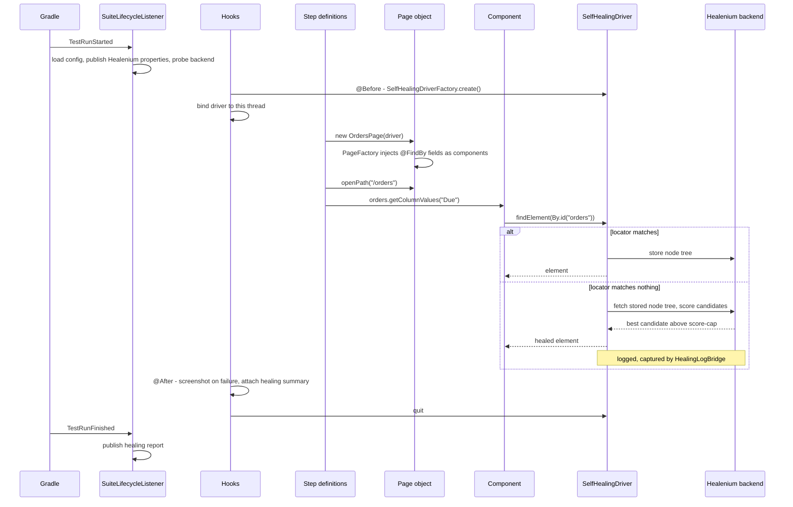

# Architecture

## Shape

```
config/     resolves settings from four layers into typed values
driver/     turns those settings into a WebDriver, optionally self-healing, held per thread
elements/   typed components, and the PageFactory extension that injects them
pages/      the page base class: waits, retries, frames, alerts, scripts, windows
healing/    makes healing visible - metrics, log bridge, report collection, wait conditions
support/    retry, screenshots, CI detection, dynamic token resolution
exception/  three failures worth naming
```

Dependencies point one way: `pages` uses `elements`, `elements` uses `pages` (a component *is* a
page rooted at an element), and both use `config`, `healing` and `support`. Nothing in
`src/main` knows about Cucumber, JUnit or any particular application. The demo suite under
`src/test` is a consumer of the library like any other project would be, which is the point - if a
framework's own tests can only run inside it, the framework is not reusable.

## The load-bearing decisions

### Typed components instead of raw `WebElement`

Selenium's `PageFactory` can fill a field only if it is a `WebElement` or a `List<WebElement>`.
Everything a widget knows how to do therefore ends up in the page object, and page objects grow into
thousand-line classes where `selectCountry`, `selectCurrency` and `selectTimezone` are three copies
of the same twelve lines.

`ComponentFieldDecorator` lifts that restriction. A field can be declared as the widget it is:

```java
@FindBy(id = "orders")      private DataTable orders;
@FindBy(css = ".filters")   private List<SelectDropdown> filters;
@FindBy(css = "h1")         private WebElement heading;   // still works
```

A class becomes injectable purely by declaring a constructor taking `(WebDriver, WebElement)` or
`(WebDriver, SearchContext, WebElement)`. There is no registry, no annotation and no base class to
extend beyond `BaseComponent` - which means adding a component to a project is adding a file.

How it works, in four steps:

1. The decorator checks whether the field's type - or, for a `List`, its element type - declares one
   of those constructors.
2. It builds a JDK dynamic proxy standing in for the element, backed by the field's `ElementLocator`
   (`LocatingComponentHandler`). Nothing is looked up until the component is used.
3. It constructs the component around that proxy. For a `List` field the entire list is a proxy that
   re-resolves and rebuilds its components on every call (`LocatingComponentListHandler`), so a table
   that re-renders between `size()` and `get(2)` cannot hand back a detached node.
4. Anything that is not a component falls through to Selenium's `DefaultFieldDecorator`.

Step 4 differs from the framework this was extracted from, which returned `null` for non-component
fields and therefore needed two `PageFactory` passes - one bound to the driver for plain elements,
one bound to the component root for components. The side effect was a real bug: a plain `WebElement`
field inside a component was searched from the whole document rather than from the component. One
pass with a fallback fixes that and halves the reflection.

Also dropped: the original threaded a `Class<?>` generic type through the decorator to support one
generically-typed table, which cost a Guava dependency for `TypeToken`. Plain reflection covers
everything here.

### Locator retention instead of `toString()` parsing

The original recovered a stale element by parsing `WebElement.toString()` for markers like
`"-> xpath:"`. `BaseComponent` keeps its `By` and its parent `SearchContext` instead, so recovery is
exact and deterministic. [SELF_HEALING.md](SELF_HEALING.md#locator-retention-why-this-framework-does-not-parse-tostring)
has the full reasoning; it is the clearest example of the difference between code that works and
code that will keep working.

### A component is a page rooted at an element

`BaseComponent extends BasePage`. That looks odd until you notice what `BasePage` actually is: a
driver plus a `SearchContext` plus the primitives for working within it. A page's context is the
document; a component's is its element. Sharing the base means components get the same waits, script
execution, scrolling and implicit-timeout guard as pages, and their own `@FindBy` fields are scoped
to their element automatically.

One wrinkle is worth knowing about. Field injection needs the component's root element, which does
not exist until the component's own constructor has run - and calling an overridable method from a
superclass constructor would read fields the subclass has not assigned yet. So `BasePage` has a
three-argument constructor with an `initialiseFields` flag; components pass `false` and call
`initFields(asSearchContext())` themselves once their element is known. The comment in the
constructor says so, because the alternative is somebody "simplifying" it later.

### A `ThreadLocal` driver

`DriverManager` holds the driver per thread, so `-Pthreads=4` is the only change needed to run four
scenarios at once. With a singleton, parallel scenarios share one browser and produce failures that
cannot be read.

The contract is deliberately narrow. The hooks own the lifecycle - `set` in `@Before`, `quit` in
`@After` - and everything else only reads. Page objects take the driver as a constructor argument
rather than reaching for the thread-local, which is what keeps them usable from a plain JUnit test
with a driver you created yourself. `quit()` removes the thread-local entry even when the browser
refuses to close, because a stale entry on a pooled thread would be handed to the next scenario.

### Scenario state without a DI container

Cucumber builds a fresh instance of every glue class per scenario, so two step classes cannot see
each other's fields. The usual answer is Guice or PicoContainer. `ScenarioContext` is a thread-local
map instead: one fewer dependency, no `@Inject` ceremony, and parallel-safe because it is
thread-local rather than static. If your project already runs a DI container, delete it and inject a
scenario-scoped object - nothing else depends on it.

### Suite lifecycle through a Cucumber plugin

Cucumber has no "once per run" hook, and a static flag inside `@Before` is a race the moment
scenarios run in parallel. `SuiteLifecycleListener` is a `ConcurrentEventListener` bound to
`TestRunStarted` and `TestRunFinished`, which is the supported way to get one. It logs the resolved
configuration (so a failed run can be reproduced from its log rather than from a guess), publishes
Healenium's system properties before any driver exists, probes the backend once, and publishes the
healing report at the end.

## A scenario, end to end



## What was deliberately left out

Extracting a framework is mostly deciding what not to carry:

- **Application-specific page helpers.** The original page base had toast assertions, notification
  dismissal, picklist helpers and country-specific phone-number generators. Useful there, meaningless
  anywhere else. Only the primitives survived.
- **API clients, database access and test-data builders.** Substantial parts of the original, and
  all of them coupled to one company's services.
- **A dependency-injection container.** See above.
- **WebDriverManager and a pinned driver version.** Selenium Manager does this now.
- **Guava.** Used only for `TypeToken` in the decorator; plain reflection is enough.
- **Commons-lang3.** Used only for `StringUtils.normalizeSpace`; one regex replaced it.
- **Lombok.** A build-time annotation processor and an IDE plugin, to save a few getters in a
  codebase that has almost no data classes.
- **Test-management and chat integrations.** Reporting belongs in Allure; anything beyond that is a
  per-organisation choice and does not belong in a library.

## Extending it

| You want to | Do this |
|-------------|---------|
| Add a widget type | Extend `BaseComponent`, declare the four constructors, done - `@FindBy` picks it up |
| Support another browser | Add a value to `BrowserType`, a branch in `DriverOptionsBuilder` and one in `DriverFactory`; the enum is exhaustive so the compiler finds both |
| Change browser flags | Subclass `DriverOptionsBuilder` and override one method |
| Add a configuration key | See [CONFIGURATION.md](CONFIGURATION.md#adding-a-key) |
| Add a dynamic token | `DynamicTokens.register("run-id", () -> ...)` at start-up |
| Replace the reporting | `HealingReportCollector` and `Screenshots` are the only two classes that know Allure exists |
